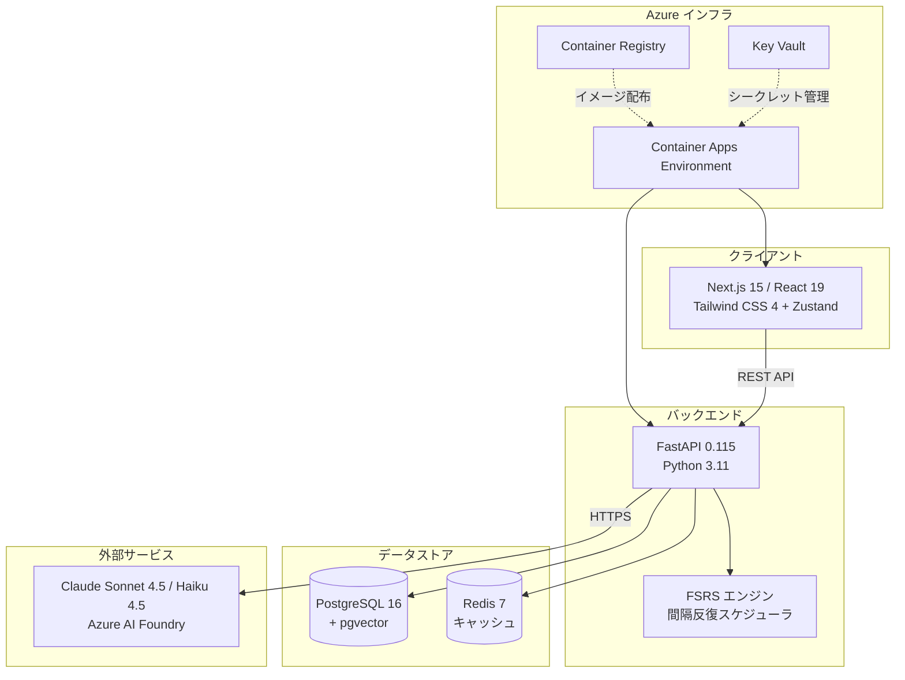

# FluentEdge AI

<!-- バッジプレースホルダー -->


> AI を活用したビジネス英語トレーニングアプリケーション。Claude (Sonnet 4.5 / Haiku 4.5) による会話練習、瞬間英作文ドリル、FSRS 間隔反復アルゴリズムで効率的な英語力向上を実現します。

---

## アーキテクチャ概要



### ASCII アーキテクチャ図

```
┌─────────────────────────────────────────────────────────────────┐
│                        Azure Cloud                              │
│                                                                 │
│  ┌──────────────┐    ┌──────────────────────────────────────┐   │
│  │   ACR        │    │     Container Apps Environment       │   │
│  │ (Registry)   │    │                                      │   │
│  │              │───>│  ┌────────────┐  ┌────────────────┐  │   │
│  └──────────────┘    │  │ Frontend   │  │   Backend      │  │   │
│                      │  │ Next.js 15 │  │   FastAPI      │  │   │
│  ┌──────────────┐    │  │ React 19   │  │                │  │   │
│  │  Key Vault   │    │  │ :3000      │  │   :8000        │  │   │
│  │ (Secrets)    │───>│  └─────┬──────┘  └───┬──────┬─────┘  │   │
│  └──────────────┘    │        │              │      │        │   │
│                      └────────┼──────────────┼──────┼────────┘   │
│                               │              │      │            │
│                       REST API│       ┌──────┘      │            │
│                               v       v             v            │
│                        ┌─────────────────┐  ┌──────────────┐    │
│                        │  PostgreSQL 16   │  │  Redis 7     │    │
│                        │  + pgvector      │  │  (Cache)     │    │
│                        │  Flexible Server │  │              │    │
│                        └─────────────────┘  └──────────────┘    │
│                                                                  │
│                        ┌──────────────────┐                      │
│                        │ Azure AI Foundry │                      │
│                        │ ┌──────────────┐ │                      │
│                        │ │Claude Sonnet │ │ <-- 会話生成         │
│                        │ │ 4.5          │ │                      │
│                        │ ├──────────────┤ │                      │
│                        │ │Claude Haiku  │ │ <-- 評価/スコアリング│
│                        │ │ 4.5          │ │                      │
│                        │ └──────────────┘ │                      │
│                        └──────────────────┘                      │
└──────────────────────────────────────────────────────────────────┘
```

---

## 技術スタック

| カテゴリ | 技術 | バージョン |
|---|---|---|
| **フロントエンド** | Next.js / React / TypeScript | 15.1 / 19.0 / 5.7 |
| **UI** | Tailwind CSS / Lucide React | 4.0 / 0.468 |
| **状態管理** | Zustand | 5.0 |
| **バックエンド** | FastAPI / Uvicorn | 0.115.6 / 0.34.0 |
| **ORM** | SQLAlchemy (async) | 2.0.36 |
| **マイグレーション** | Alembic | 1.14.1 |
| **DB** | PostgreSQL + pgvector | 16 |
| **キャッシュ** | Redis | 7 (Alpine) |
| **LLM** | Claude Sonnet 4.5 / Haiku 4.5 | Azure AI Foundry 経由 |
| **認証** | JWT (dev) / Microsoft Entra External ID (prod) | -- |
| **IaC** | Azure Bicep | Container Apps |
| **コンテナ** | Docker / Docker Compose | -- |

---

## クイックスタート

### 前提条件

- **Python** 3.11+
- **Node.js** 20 LTS+
- **Docker Desktop** (Docker Compose v2+)
- **Azure AI Foundry API キー** (Claude アクセス用)

### 1. リポジトリをクローン

```bash
git clone <repository-url>
cd neurofluent
```

### 2. 環境変数を設定

```bash
cp .env.example .env
# .env を編集して API キーなどを設定
```

最低限必要な設定:

| 変数名 | 説明 | 必須 |
|---|---|---|
| `AZURE_AI_FOUNDRY_ENDPOINT` | Azure AI Foundry エンドポイント | Yes |
| `AZURE_AI_FOUNDRY_API_KEY` | Azure AI Foundry API キー | Yes |
| `JWT_SECRET_KEY` | JWT 署名キー（本番では必ず変更） | Yes |
| `DATABASE_URL` | PostgreSQL 接続文字列 (async) | Yes |
| `REDIS_URL` | Redis 接続文字列 | Yes |

### 3. Docker でインフラを起動

```bash
docker compose up -d
```

PostgreSQL 16 (pgvector) と Redis 7 が起動します。

### 4. バックエンドをセットアップ

```bash
cd backend
python -m venv venv
source venv/bin/activate        # Windows: venv\Scripts\activate
pip install -r requirements.txt

# データベースマイグレーション
alembic upgrade head

# バックエンド起動
uvicorn app.main:app --reload --port 8000
```

### 5. フロントエンドをセットアップ

```bash
cd frontend
npm install
npm run dev
```

### 6. 動作確認

| サービス | URL |
|---|---|
| バックエンド API | http://localhost:8000/health |
| Swagger UI (API ドキュメント) | http://localhost:8000/docs |
| ReDoc | http://localhost:8000/redoc |
| フロントエンド | http://localhost:3000 |

詳細は [セットアップガイド](docs/setup-guide.md) を参照してください。

---

## プロジェクト構成

```
neurofluent/
├── .env.example                    # 環境変数テンプレート
├── .gitignore
├── docker-compose.yml              # PostgreSQL 16 (pgvector) + Redis 7
├── FluentEdge_仕様書_v2.md         # 機能仕様書
├── README.md                       # 本ファイル
│
├── backend/                        # FastAPI バックエンド
│   ├── Dockerfile                  # Python 3.11-slim ベースイメージ
│   ├── requirements.txt            # Python 依存パッケージ
│   ├── alembic.ini                 # Alembic 設定
│   ├── alembic/
│   │   ├── env.py                  # マイグレーション環境設定
│   │   ├── script.py.mako
│   │   └── versions/               # マイグレーションファイル
│   └── app/
│       ├── main.py                 # FastAPI アプリケーションエントリポイント
│       ├── config.py               # pydantic-settings 環境設定
│       ├── database.py             # SQLAlchemy async エンジン・セッション
│       ├── dependencies.py         # JWT 認証ディペンデンシー
│       ├── models/                 # SQLAlchemy モデル
│       │   ├── user.py             #   ユーザー
│       │   ├── conversation.py     #   会話セッション / メッセージ
│       │   ├── review.py           #   復習アイテム (FSRS)
│       │   ├── stats.py            #   日次統計
│       │   └── api_usage.py        #   API 使用量追跡
│       ├── schemas/                # Pydantic リクエスト / レスポンス
│       │   ├── auth.py             #   認証
│       │   ├── talk.py             #   会話練習
│       │   ├── speaking.py         #   瞬間英作文
│       │   └── review.py           #   復習
│       ├── routers/                # API ルーター
│       │   ├── health.py           #   /health
│       │   ├── auth.py             #   /api/auth/*
│       │   ├── talk.py             #   /api/talk/*
│       │   ├── speaking.py         #   /api/speaking/*
│       │   ├── review.py           #   /api/review/*
│       │   └── analytics.py        #   /api/analytics/*
│       ├── services/               # ビジネスロジック
│       │   ├── claude_service.py   #   Claude API クライアント
│       │   ├── feedback_service.py #   文法・表現フィードバック生成
│       │   ├── flash_service.py    #   瞬間英作文エクササイズ生成・評価
│       │   └── spaced_repetition.py #  FSRS アルゴリズム実装
│       └── prompts/                # LLM プロンプトテンプレート
│           ├── conversation.py     #   会話システムプロンプト
│           ├── feedback.py         #   フィードバック生成プロンプト
│           └── flash_translation.py #  瞬間英作文プロンプト
│
├── frontend/                       # Next.js フロントエンド
│   ├── package.json
│   ├── next.config.ts
│   ├── tsconfig.json
│   ├── tailwind.config.ts
│   ├── postcss.config.mjs
│   ├── public/
│   │   └── manifest.json           # PWA マニフェスト
│   ├── app/                        # Next.js App Router ページ
│   │   ├── layout.tsx              #   ルートレイアウト
│   │   ├── page.tsx                #   ダッシュボード（ホーム）
│   │   ├── globals.css             #   グローバルスタイル
│   │   ├── login/page.tsx          #   ログインページ
│   │   ├── talk/page.tsx           #   AI Free Talk ページ
│   │   ├── talk/review/[id]/page.tsx  # セッションレビュー
│   │   ├── speaking/flash/page.tsx #   瞬間英作文ページ
│   │   └── review/page.tsx         #   復習ページ
│   ├── components/
│   │   ├── chat/                   #   チャット UI コンポーネント
│   │   │   ├── ChatWindow.tsx
│   │   │   ├── MessageBubble.tsx
│   │   │   └── FeedbackPanel.tsx
│   │   ├── drill/                  #   ドリル UI コンポーネント
│   │   │   ├── FlashCard.tsx
│   │   │   └── ReviewCard.tsx
│   │   └── layout/                 #   レイアウトコンポーネント
│   │       ├── AppShell.tsx
│   │       ├── Sidebar.tsx
│   │       └── BottomNav.tsx
│   └── lib/
│       ├── api.ts                  #   API クライアント
│       └── stores/                 #   Zustand ストア
│           ├── auth-store.ts
│           └── talk-store.ts
│
├── infra/                          # Azure Bicep IaC
│   ├── main.bicep                  #   メインオーケストレーション
│   ├── modules/
│   │   ├── container-apps.bicep
│   │   ├── container-registry.bicep
│   │   ├── postgresql.bicep
│   │   ├── redis.bicep
│   │   └── key-vault.bicep
│   └── environments/
│       └── dev.bicepparam          #   開発環境パラメータ
│
└── docs/                           # ドキュメント
    ├── setup-guide.md              #   セットアップガイド
    ├── operation-manual.md         #   運用マニュアル
    ├── api-reference.md            #   API リファレンス
    └── deployment-guide.md         #   デプロイメントガイド
```

---

## API エンドポイント一覧

| メソッド | エンドポイント | 説明 | Phase |
|---|---|---|---|
| **認証** ||||
| `POST` | `/api/auth/register` | ユーザー新規登録 → トークン発行 | 1 |
| `POST` | `/api/auth/login` | ログイン → トークン発行 | 1 |
| `GET` | `/api/auth/me` | 現在のユーザー情報取得 | 1 |
| **AIトーク** ||||
| `POST` | `/api/talk/start` | 会話セッション開始 | 1 |
| `POST` | `/api/talk/message` | メッセージ送信（AI応答 + フィードバック） | 1 |
| `GET` | `/api/talk/sessions` | セッション一覧 | 1 |
| `GET` | `/api/talk/sessions/:id` | セッション詳細 | 1 |
| `POST` | `/api/talk/realtime/start` | リアルタイム音声セッション開始 | 2 |
| `WS` | `/api/talk/realtime/ws/:id` | WebSocket 音声ストリーム | 2 |
| **スピーキング** ||||
| `GET` | `/api/speaking/flash` | 瞬間英作文エクササイズ取得 | 1 |
| `POST` | `/api/speaking/flash/check` | 回答チェック + スコアリング | 1 |
| `GET` | `/api/speaking/pattern/categories` | パターンカテゴリ一覧 | 2 |
| `GET` | `/api/speaking/pattern/exercises` | パターン練習問題取得 | 2 |
| `POST` | `/api/speaking/pattern/check` | パターン回答評価 | 2 |
| `GET` | `/api/speaking/pronunciation/phonemes` | 日本語話者の発音問題一覧 | 4 |
| `GET` | `/api/speaking/pronunciation/exercises` | 発音練習問題生成 | 4 |
| `POST` | `/api/speaking/pronunciation/evaluate` | 発音評価（Azure Speech） | 4 |
| **リスニング** ||||
| `GET` | `/api/listening/shadowing/material` | シャドーイング素材生成 | 2 |
| `POST` | `/api/listening/shadowing/evaluate` | シャドーイング音声評価 | 2 |
| `POST` | `/api/listening/tts` | テキスト→音声変換 (TTS) | 2 |
| `GET` | `/api/listening/mogomogo` | もごもご素材一覧 | 3 |
| `POST` | `/api/listening/mogomogo/evaluate` | もごもご練習評価 | 3 |
| `GET` | `/api/listening/comprehension` | リスニング理解度テスト | 4 |
| `POST` | `/api/listening/comprehension/check` | 理解度回答送信 | 4 |
| **復習 (FSRS)** ||||
| `GET` | `/api/review/due` | 本日の復習対象アイテム取得 | 1 |
| `POST` | `/api/review/complete` | 復習完了（FSRS レーティング更新） | 1 |
| **分析** ||||
| `GET` | `/api/analytics/dashboard` | ダッシュボード統計データ | 1 |
| `GET` | `/api/analytics/advanced` | 高度な分析（スキルレーダー等） | 3 |
| `GET` | `/api/analytics/advanced/report/weekly` | 週次レポート | 3 |
| `GET` | `/api/analytics/advanced/report/monthly` | 月次レポート | 3 |
| **サブスクリプション** ||||
| `GET` | `/api/subscription/plans` | プラン一覧 | 3 |
| `GET` | `/api/subscription/current` | 現在のサブスクリプション | 3 |
| `POST` | `/api/subscription/checkout` | Stripeチェックアウト | 3 |
| `POST` | `/api/subscription/cancel` | サブスクリプション解約 | 3 |
| `POST` | `/api/subscription/webhook` | Stripe Webhook | 3 |
| **その他** ||||
| `GET` | `/health` | ヘルスチェック | 1 |

詳細は [API リファレンス](docs/api-reference.md) を参照してください。

---

## 開発コマンド一覧

### インフラ (Docker)

```bash
docker compose up -d          # PostgreSQL + Redis 起動
docker compose down            # 停止
docker compose down -v         # ボリューム含めて完全削除
docker compose ps              # コンテナ状態確認
docker compose logs -f postgres  # PostgreSQL ログ
docker compose logs -f redis     # Redis ログ
```

### バックエンド (Python / FastAPI)

```bash
cd backend

# 仮想環境
python -m venv venv
source venv/bin/activate            # Windows: venv\Scripts\activate
pip install -r requirements.txt

# 開発サーバー（ホットリロード）
uvicorn app.main:app --reload --port 8000

# Alembic マイグレーション
alembic revision --autogenerate -m "説明"   # 新規作成
alembic upgrade head                         # 適用
alembic downgrade -1                         # 1つ戻す
alembic history                              # 履歴確認
alembic current                              # 現在のリビジョン
```

### フロントエンド (Node.js / Next.js)

```bash
cd frontend

npm install        # 依存パッケージインストール
npm run dev        # 開発サーバー起動
npm run build      # 本番ビルド
npm run start      # 本番サーバー起動
npm run lint       # Lint チェック
```

---

## デプロイ

本アプリケーションは **Azure Container Apps** にデプロイする設計です。Bicep テンプレートで以下のリソースをプロビジョニングします:

- **Azure Container Apps Environment** -- バックエンド + フロントエンドコンテナ
- **Azure Database for PostgreSQL Flexible Server** -- pgvector 拡張対応
- **Azure Cache for Redis** -- セッション・キャッシュ
- **Azure Key Vault** -- シークレット管理
- **Azure Container Registry** -- Docker イメージ管理

```bash
# 開発環境へのデプロイ例
az deployment group create \
  --resource-group fluentedge-dev-rg \
  --template-file infra/main.bicep \
  --parameters infra/environments/dev.bicepparam
```

詳細は [デプロイメントガイド](docs/deployment-guide.md) を参照してください。

---

## MVP 4 機能

| # | 機能 | 説明 |
|---|---|---|
| 1 | **AI Free Talk** | Claude Sonnet 4.5 とのテキストベース英会話 + リアルタイム文法・表現フィードバック |
| 2 | **瞬間英作文 (Flash Translation)** | 日本語 → 英語の即時翻訳ドリル + Claude Haiku 4.5 による AI スコアリング |
| 3 | **FSRS 間隔反復** | 19 パラメータの忘却曲線アルゴリズムによる復習スケジューリング |
| 4 | **ダッシュボード** | ストリーク、累計統計、直近 7 日間の学習アクティビティ可視化 |

---

## ドキュメント

| ドキュメント | 内容 |
|---|---|
| [セットアップガイド](docs/setup-guide.md) | ローカル開発環境の構築手順 |
| [運用マニュアル](docs/operation-manual.md) | 4 機能の使い方と管理者向け操作 |
| [API リファレンス](docs/api-reference.md) | 全エンドポイントの詳細仕様 |
| [デプロイメントガイド](docs/deployment-guide.md) | Azure へのデプロイ手順 |

---

## コントリビューション

コントリビューションを歓迎します。以下の手順でお願いします。

1. このリポジトリをフォーク
2. フィーチャーブランチを作成 (`git checkout -b feature/amazing-feature`)
3. 変更をコミット (`git commit -m 'Add amazing feature'`)
4. ブランチにプッシュ (`git push origin feature/amazing-feature`)
5. プルリクエストを作成

### コーディング規約

- **Python**: PEP 8 準拠、型ヒント必須
- **TypeScript**: ESLint + Next.js 推奨ルール
- **コメント・ドキュメント**: 日本語
- **コード（変数名・関数名）**: 英語

---

## ライセンス

MIT License

Copyright (c) 2025 FluentEdge AI

Permission is hereby granted, free of charge, to any person obtaining a copy of this software and associated documentation files (the "Software"), to deal in the Software without restriction, including without limitation the rights to use, copy, modify, merge, publish, distribute, sublicense, and/or sell copies of the Software, and to permit persons to whom the Software is furnished to do so, subject to the following conditions:

The above copyright notice and this permission notice shall be included in all copies or substantial portions of the Software.

THE SOFTWARE IS PROVIDED "AS IS", WITHOUT WARRANTY OF ANY KIND, EXPRESS OR IMPLIED, INCLUDING BUT NOT LIMITED TO THE WARRANTIES OF MERCHANTABILITY, FITNESS FOR A PARTICULAR PURPOSE AND NONINFRINGEMENT.

---

**FluentEdge AI** -- AI の力でビジネス英語を加速する
